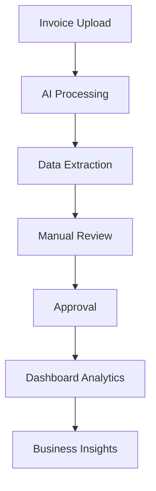

# Analytics Dashboard

## Overview

This comprehensive analytics dashboard provides real-time insights into the service invoice management digitizer application. It offers a complete view of invoice processing performance, cost analytics, vehicle data, and business intelligence metrics.

## Features

### 📊 Key Metrics Overview

- **Total Invoices**: Track the total number of invoices processed
- **AI Success Rate**: Monitor the accuracy of AI processing
- **Processing Time**: Average time to process invoices
- **Cost Metrics**: Total and monthly cost processing

### 📈 Analytics Sections

#### 1. Trends Tab

- **Monthly Invoice Trends**: Line chart showing invoice volume over time
- **Daily Processing Performance**: Area chart showing success/failure rates

#### 2. Distribution Tab

- **Service Type Distribution**: Pie chart breaking down service categories
- **Invoice Status Breakdown**: Visual representation of processing states

#### 3. Vehicles Tab

- **Vehicle Analytics by Make**: Horizontal bar chart showing vehicle distribution
- **Make-specific insights**: Count and average costs per vehicle manufacturer

#### 4. Costs Tab

- **Monthly Cost Trends**: Bar chart of cost evolution
- **Cost Breakdown by Category**: Labor, parts, materials, and other expenses

### 🔔 Real-time Features

- **Recent Activity Feed**: Live updates of system activities
- **Quick Actions Panel**: Direct access to common tasks
- **Status Indicators**: Real-time processing status

### 🚀 Quick Actions

- Add New Invoice
- Review Pending Items
- Export Analytics Data
- Sync Data

## Technical Implementation

### Components Used

- **Recharts**: For all chart visualizations
- **shadcn/ui**: UI component library
- **Lucide Icons**: Icon system
- **Next.js**: Framework
- **RTK Query**: Data fetching and caching

### Data Structure

```typescript
interface DashboardMetrics {
  overview: OverviewMetrics;
  trends: TrendData;
  serviceTypes: ServiceTypeDistribution[];
  vehicleAnalytics: VehicleAnalytics[];
  recentActivity: ActivityItem[];
  costBreakdown: CostBreakdownItem[];
}
```

### API Endpoints

- `GET /dashboard/analytics` - Main dashboard data
- `GET /dashboard/service-types` - Service type distribution
- `GET /dashboard/vehicles` - Vehicle analytics
- `GET /dashboard/activity` - Recent activity feed
- `POST /dashboard/export` - Export dashboard data

## Use Case: Service Invoice Digitizer

This dashboard is specifically designed for a **Service Invoice Management Digitizer** system that:

1. **Processes Vehicle Service Invoices**: Handles PDF invoices for vehicle maintenance
2. **AI-Powered Data Extraction**: Automatically extracts service details, costs, parts, and labor
3. **Multi-step Workflow**:
   - Upload invoice PDF
   - AI processing and data extraction
   - Manual review and verification
   - Approval and finalization
4. **Comprehensive Tracking**: Monitors every step from upload to completion

### Business Value

- **Efficiency Monitoring**: Track AI processing success rates
- **Cost Analysis**: Understand service cost patterns
- **Vehicle Insights**: Analyze maintenance by vehicle make/model
- **Operational Intelligence**: Monitor processing bottlenecks
- **Quality Assurance**: Track manual review requirements

## Data Flow



## Navigation

The dashboard is accessible via:

- **URL**: `/dashboard`
- **Sidebar**: "Analytics Dashboard" menu item
- **Home Redirect**: Root path (`/`) redirects to dashboard

## Responsive Design

The dashboard is fully responsive and adapts to:

- Desktop (1920px+)
- Tablet (768px - 1919px)
- Mobile (320px - 767px)

## Future Enhancements

- [ ] Real-time WebSocket updates
- [ ] Custom date range filtering
- [ ] Advanced export options (PDF, Excel)
- [ ] Drill-down capabilities
- [ ] Comparative analytics (YoY, MoM)
- [ ] Alert and notification system
- [ ] Custom dashboard widgets
